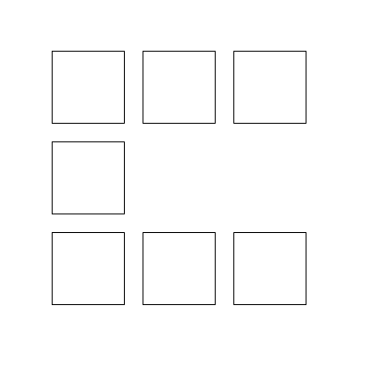
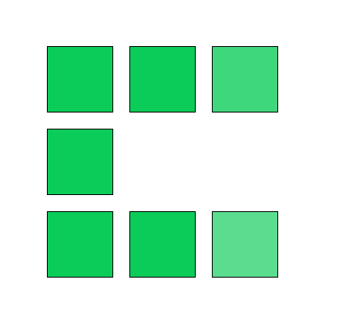

# Uber Frontend Interview Challenge Solution

## Overview

The Shape component is a solution to Uber's frontend interview challenge. It renders a visual representation based on a 2D array (`data`). Each element in the array determines the visibility of a box, where `1` represents a visible box and `0` represents a hidden box. Users can interact with the boxes by selecting them, which changes their background color to green. Once all visible boxes are selected, they are sequentially deselected in the order they were selected, with a brief delay between each deselection. During this sequence, all interaction with the component is disabled.

## Features

- Dynamic Rendering: Renders boxes based on the 2D array provided as `data`.
- Selection: Allows users to select visible boxes by clicking on them.
- Deselection Sequence: Initiates an automatic deselection sequence once all visible boxes are selected.
- Visual Feedback: Selected boxes are highlighted with a green background.
- Interaction Control: Disables interaction during the deselection sequence to prevent user input.

## Usage

To use the Shape component, pass a `data` prop containing a 2D array of numbers. Each inner array should correspond to a row of boxes, where:

`1` indicates a visible box.
`0` indicates a hidden box.

## CSS Modules

The component uses CSS Modules for styling. Ensure that your build system supports importing CSS files as modules. The styles are structured as follows:

- `Shape.module.css`: Contains styles for rendering and interaction behaviors of the Shape component.

## Implementation Details

- useState: Manages the state of selected boxes (`selected`) and the unloading state (`unloading`).
- useRef: Holds a reference to the timer used during the deselection sequence.
- useMemo: Optimizes performance by memoizing derived data (`boxes`, `countOfVisibleBoxes`).
- useEffect: Triggers the automatic deselection sequence when all visible boxes are selected (`selected.size >= countOfVisibleBoxes`).

## Additional Notes

This component assumes that the provided data array is well-formed and correctly represents the intended shape. Invalid input (e.g., arrays of different lengths within data) may lead to unexpected behavior.

## Screenshot

### Boxes

### Filled Boxes

